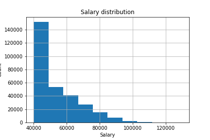
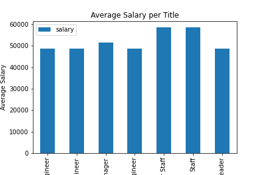

# Data-modeling-engineering-analysis-SQL

## Performing Data Modeling, Data Engineering and Data Analysis using SQL and Pandas

1. Create a new db in ```pgAdmin``` called "employee"

1. Create a table schema for each of the six CSV files in the *Data* folder. You can use [This link](http://www.quickdatabasediagrams.com) to scetch out an ERD of the tables. 

1. Import each CSV file into the corresponding SQL table. 

1. To do data analysis with Pandas in jupyter notebook import ```create_engine``` from ```sqlalchemy```.

1. Create engine and connection. 

This histogram is showing the salary distrubution among the employers. 



This graph shows the Average salary per title. 



The queries in pgAdmin include:

1. A list showing employee number, last name, first name, sex, and salary for each employee

1. A list showing first name, last name, and hire date for employees who were hired in 1986.

1. A list showing the manager of each department with the following information: department number, department name, the manager's employee number, last name, first name.

1. A list showingthe department of each employee with the following information: employee number, last name, first name, and department name.

1. A list showing first name, last name, and sex for employees whose first name is "Hercules" and last names begin with "B."

1. A list showing all employees in the Sales department, including their employee number, last name, first name, and department name.

1. A list showing all employees in the Sales and Development departments, including their employee number, last name, first name, and department name.

1. A list showing the frequency count of employee last names, in descending order. ( i.e., how many employees share each last name)
